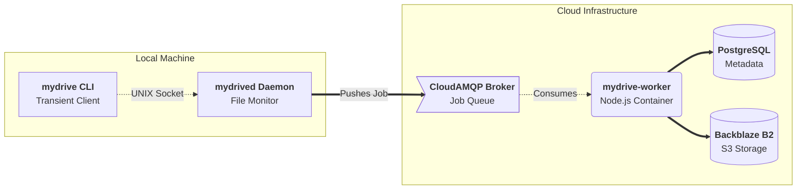
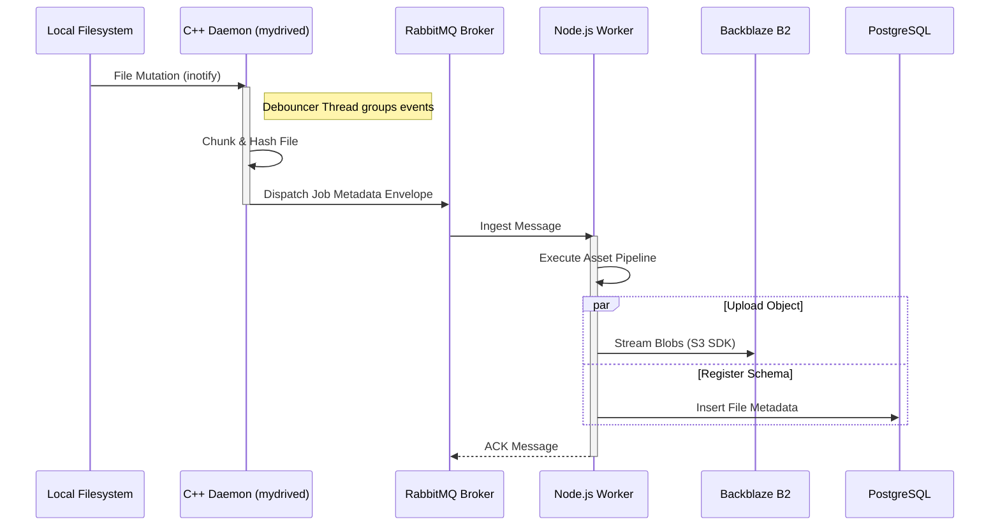

<div align="center">
  
# myDrive Vault

**A high-performance, self-hosted, secure cloud synchronization ecosystem.**

[](https://opensource.org/licenses/MIT)
[](https://cplusplus.com/)
[](https://nodejs.org/)
[](https://www.docker.com/)
[](https://www.rabbitmq.com/)
[](https://www.postgresql.org/)

</div>

---

## Project Overview

**myDrive Vault** is designed as an ultra-efficient cloud synchronization platform. The system is strategically split into a **low-footprint C++ local core** for immediate filesystem interaction and a **containerized, resilient cloud-native background worker tier** for heavy processing. 

The architecture strictly adheres to a decoupling pattern, optimizing for:
- **Low local resource utilization**
- **Instant event-driven concurrency**
- **Robust queue-based cloud processing**

---

## System Topology

The platform operates across three distinct computational layers:

1. **The CLI Controller (`mydrive`)**: A transient, low-overhead C++ client used to pass management commands to the daemon.
2. **The Local Core Engine Daemon (`mydrived`)**: A long-running C++ Linux background service responsible for filesystem monitoring, authorization, local file handling, and Inter-Process Communication (IPC).
3. **The Cloud Compute Worker (`mydrive-worker`)**: A continuous Node.js/TypeScript microservice containerized via Docker and deployed in the cloud, listening asynchronously to message brokers for heavy data-processing pipelines.



---

## Component Deep Dive

### A. The Local C++ Core Engine (`mydrived` & `mydrive`)

Built natively for Linux systems (highly optimized for Debian-based distributions like Pop!_OS and Ubuntu), the local core handles all foundational file mechanics with zero bloat.

- **Inter-Process Communication (IPC)**: Modeled via UNIX Domain Sockets (`AF_UNIX`) listening natively at `/tmp/mydrive.sock`. The CLI client opens a standard streaming socket, drops a lightweight command payload, receives an instantaneous string payload response, and exits, ensuring entirely non-blocking operations.
- **Threading Architecture**: Employs a hardware-concurrency-optimized Thread Pool. Scaling up to 12 parallel threads on modern multi-core systems, it guarantees the prevention of system starvation during massive bulk file operations.
- **Supported Local Commands**:
  - `mydrived --auth <key>`: Extracts, validates, and provisions localized environment variables securely under `~/.config/mydrive/.env`.

### B. The Cloud Compute Worker Layer (`mydrive-worker`)

The execution backend tackles highly asynchronous, compute-intensive operations, decoupled completely from the user's local machine.

- **Language Runtime**: Node.js v20 runtime natively orchestrated through TypeScript (`ts-node`) for strict type safety and modern JS features.
- **Message Broker / Queue Management**: Implements a highly resilient event-driven loop via RabbitMQ (`amqplib`) pointing to a CloudAMQP broker instance. It consumes from the `file-processing-queue` utilizing `prefetch(1)` to balance loads optimally across instances without message collision.
- **Persistence & Storage Drivers**:
  - **Database**: High-concurrency relational layer communicating via native PostgreSQL drivers (`pg`).
  - **Object Storage**: High-performance chunk uploading leveraging AWS S3 SDK wrappers targeting cost-efficient Backblaze B2 buckets.
- **Cloud Health Monitoring**: Exposes a localized Express.js HTTP Server processing automated Keep-Alive ping routes (`/health`) to maintain zero-downtime persistence and auto-healing capabilities.

---

## Data & Control Flow Pipeline

When a local file is altered, myDrive Vault executes a seamless, multi-stage ingestion pipeline.



1. **Mutation Capture**: Local operations on files trigger operating system notification boundaries (inotify).
2. **Local Processing**: The C++ daemon catches the event, passes it to the thread pool, hashes file chunks, and dispatches the transactional job envelope directly to the RabbitMQ exchange.
3. **Queue Ingestion**: The message broker queues the file mutation securely, acting as a highly-available buffer.
4. **Cloud Resolution**: The Docker-bound worker ingests the message from the queue, executes heavy asset pipelines, mirrors structural blobs up to Backblaze B2, and registers schemas to the PostgreSQL instance.

---

## Key Engineering Implementations

- **Transient Network Error Mitigation**: Automatic socket unlinking (`unlink()`) prevents deadlocks stemming from un-graceful daemon crashes, ensuring smooth restarts.
- **Resilient Worker Architecture**: The RabbitMQ worker handles transient connection drops gracefully. By intentionally triggering process failures (`process.exit(1)`), it correctly leverages container auto-restart policies (Docker/Kubernetes) to seamlessly recover without manual intervention.

---

## Detailed Setup Guidelines

Follow these exact steps to initialize the local C++ engine, authenticate your machine, and bind your local directory to the cloud worker pipeline.

### Step 1: Install the Daemon
Ensure any previous ghost processes are terminated, then install the compiled Debian package natively into your Linux environment.

```bash
# Terminate old instances if updating
killall mydrived 2>/dev/null || true

# Install the package natively
sudo dpkg -i mydrive-vault_1.0.0_amd64.deb
```

### Step 2: Authenticate the Machine
Before the daemon can communicate with the cloud worker, you must provision your secure environment variables. 

```bash
# Replace <YOUR_API_KEY> with your actual key
mydrived --auth <YOUR_API_KEY>
```

### Step 3: Define Your Vault Directory
Create the local folder on your filesystem that you want the engine to continuously monitor and sync.

```bash
mkdir -p ~/Documents/mydrive_sync
```

### Step 4: Ignite the Engine
Attach the background daemon directly to your sync folder. The engine will instantly scan the directory, calculate file hashes, and spin up the multi-threaded inotify watchers.

```bash
# Run the daemon directly against your target path
mydrived ~/Documents/mydrive_sync/
```

> **Pro-Tip for 24/7 Background Execution:** If you want to detach the process from your terminal so it runs silently in the background even when you close the window, wrap the execution in `nohup`:

```bash
nohup mydrived ~/Documents/mydrive_sync/ > ~/.config/mydrive/daemon.log 2>&1 &
```

---
<div align="center">
  <i>Built with performance and security in mind.</i>
</div>
